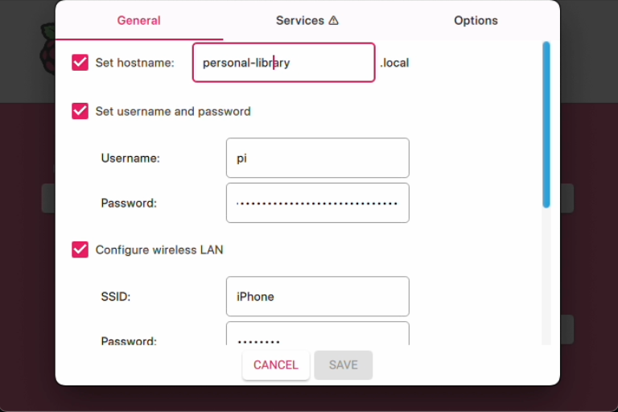

# Personal Library Management System

A web-based system for managing a library of books using NFC tags. Built with Node.js, Express, WebSockets, and a PN532 NFC reader.

## Features

* **Register Books**: Scan an NFC tag and enter book details to add it to the library.
* **Check-In/Check-Out**: Easily update a book's status by scanning its tag.
* **Real-Time Updates**: The book list on the web interface updates instantly for all users.
* **Live Scan Display**: See the title, UID, and status of the most recently scanned book.
* **Search Functionality**: Quickly find a book by its title.
* **Data Export**: Download the entire book database as a `.tsv` file directly from the browser.

## Hardware Requirements

* Raspberry Pi 4
* PN532 NFC Reader Module
* USB to Serial (UART) adapter
* NFC Tags (e.g., Mifare Classic 1K)

## File Structure

```
nfc-library-management/
├── index.js
├── package.json
├── setup.sh
├── work/
│   └── books.tsv
└── web-app/
    ├── index.html
    ├── app.js
    └── style.css
```
- **index.js**: The main backend server file. It handles WebSocket connections, serial communication with the NFC reader, and file I/O for the book database.
- **package.json**: Defines the project's Node.js dependencies.
- **setup.sh**: An automation script to set up the environment on a fresh Raspberry Pi.
- **work/books.tsv**: The database file where all book information is stored in a tab-separated format.
- **web-app/**: Contains all the frontend files.
    - **index.html**: The main HTML file for the user interface.
    - **app.js**: The client-side JavaScript that handles WebSocket communication and UI updates.
    - **style.css**: The stylesheet for the web interface.

## Setup and Installation

These instructions are for setting up the project on a fresh installation of Raspberry Pi OS. Makesure that the hostname is set to `personal-library.local` as below:

 

### 1. Clone the Repository

First, connect to your Raspberry Pi via SSH and clone the project repository:

```
git clone https://github.com/clementyu/nfc-library-management.git
cd nfc-library-management
```

### 2. Run the Setup Script

A setup script is included to automate the installation of all necessary software and dependencies.

Make the script executable:

```
chmod +x setup.sh
```

Then, run the script:

```
./setup.sh
```

This script will:

1. Install `nvm` (Node Version Manager).
2. Install Node.js v22 and set it as the default.
3. Navigate into the `nfc-library-management` directory.
4. Install all the required `npm` packages.

## Running the Application

### 1. Connect the NFC Reader

Ensure your PN532 NFC reader is connected to the Raspberry Pi via the USB to Serial adapter.

### 2. Find the Serial Port

You may need to identify the correct serial port for the reader. Run the following command to list available serial devices:

```
ls /dev/tty*
```

Look for a name like `/dev/tty.usbserial-XXXX` or `/dev/ttyUSB0`.

### 3. Launch the Server

Navigate to the project directory and start the application using `node`. You can specify the serial port and baud rate as command-line arguments.

```
node index.js --port /dev/ttyUSB0 --baudrate 115200
```

* `--port` or `-p`: The serial port your NFC reader is connected to.
* `--baudrate` or `-b`: The baud rate for the serial connection (default is 115200).

If you don't provide these arguments, the application will use the default values set in `index.js`.

### 4. Access the Web Interface

Open a web browser on any device connected to the same network as your Raspberry Pi and navigate to:

```
http://personal-library.local:8080
```

You can find your Raspberry Pi's IP address by running `hostname -I` in the terminal.